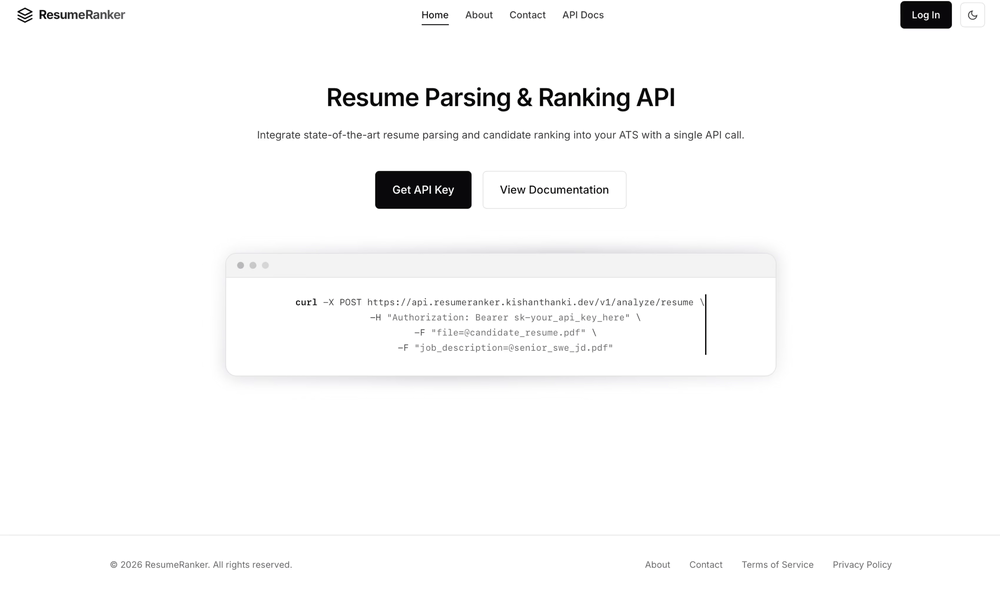

<div align="center">
  <h1>ResumeRanker</h1>
  <p><b>AI-Powered Resume Parsing and Candidate Ranking Platform</b></p>
</div>

<p align="center">
  <a href="https://resumeranker.kishanthanki.space" target="_blank" rel="noopener noreferrer">
    
  </a>
</p>

## Architecture Overview

ResumeRanker is built using a modern, polyglot microservice architecture. It strictly separates the web-facing logic from the heavy CPU/AI computation.

**System Topology:** You can view the interactive, version-controlled architecture layout here:

```mermaid
graph LR
    %% Class/Style Definitions
    classDef public fill:#fafafa,stroke:#71717a,stroke-width:2px,color:#18181b;
    classDef dmz fill:#f8fafc,stroke:#475569,stroke-width:2px,stroke-dasharray: 4 4,color:#0f172a;
    classDef app fill:#eff6ff,stroke:#2563eb,stroke-width:2px,color:#1e3a8a;
    classDef worker fill:#faf5ff,stroke:#7c3aed,stroke-width:2px,color:#4c1d95;
    classDef data fill:#f0fdf4,stroke:#16a34a,stroke-width:2px,color:#14532d;
    classDef external fill:#fff7ed,stroke:#ea580c,stroke-width:2px,color:#7c2d12;

    %% 1. PUBLIC TIER
    subgraph Public_Zone ["Public Internet"]
        UserWeb(["Browser User"])
        UserAPI(["Developer CLI"])
    end
    class Public_Zone public;

    %% 2. PRIMARY WEB & APPLICATION SERVER (Merged)
    subgraph Server_Primary ["Primary Server (Oracle Instance)"]
        Caddy["Caddy Reverse Proxy<br>Ports 80 / 443"]
        StaticFiles[("Static Assets<br>HTML / JS / CSS")]

        subgraph Private_Network ["Private Instance Internals"]
            GoAPI["Go Backend API<br>Port 8080"]
            Redis[("Redis<br>Cache & Queue")]
        end

        Caddy -.->|Local Read| StaticFiles
        Caddy ===>|Reverse Proxy HTTP| GoAPI
        GoAPI <-->|Localhost / IPC| Redis
    end
    class Server_Primary dmz;
    class Private_Network app;

    %% 3. ISOLATED WORKER TIER (Separate Server)
    subgraph Worker_Zone ["Analysis Tier (Python Server)"]
        PyEngine["Python Worker<br>Analysis Engine"]
    end
    class Worker_Zone worker;

    %% 4. ISOLATED DATA TIER
    subgraph Data_Zone ["Data Tier (Secure Cloud)"]
        Postgres[("PostgreSQL DB<br>State & Analytics")]
    end
    class Data_Zone data;

    %% 5. EXTERNAL SERVICES
    subgraph Third_Party ["External SaaS Ecosystem"]
        LLM_API[("External LLM API<br>Gemini / OpenAI")]
    end
    class Third_Party external;

    %% NETWORK TRAFFIC & DATA FLOWS
    UserWeb ===>|HTTPS: resumeranker.*| Caddy
    UserWeb ===>|HTTPS: api.resumeranker.*| Caddy
    UserAPI ===>|HTTPS: api.resumeranker.*| Caddy

    %% Go API talks across to external networks
    GoAPI ===>|gRPC RPC: Port 8001| PyEngine
    GoAPI ===>|Secure TLS: Port 5432| Postgres

    %% Python worker handles the external AI pipeline
    PyEngine ===>|HTTPS Outbound: Port 443| LLM_API
```



### The 4 Core Components:

- **`web/`**: The Frontend interface (Vanilla ES6/HTML/CSS).
- **`api/`**: The Go (Golang) monolithic backend. It acts as the gateway, translating internal Python errors into semantic HTTP status codes, propagating `RequestID` distributed tracing, and handling auth/PostgreSQL.
- **`analysis/`**: The pure-Python AI Engine running on `uvloop`. It receives PDFs via gRPC, parses them securely via `Semaphore` thread bouncers, and orchestrates LLM requests.
- **`database/`**: The isolated PostgreSQL database container.

### Shared Contracts:

- **`proto/`**: The absolute source of truth. Contains the `analysis.proto` file that both the Go API (Client) and Python Engine (Server) use to generate their networking code, guaranteeing flawless HTTP/2 communication.

## How to Spin Up

We use Docker Compose to orchestrate the entire polyglot stack seamlessly.

### 1. Configure Environment

Before starting, ensure you have your environment variables configured.
_(Important: Create your `analysis/env/dev.env` with your LLM API Key first)_

### 2. Boot the Cluster

Run the following from the root of the project to build and launch all 4 microservices simultaneously:

```bash
docker compose up --build -d
```

To view the aggregated, distributed-traced logs across the entire system:

```bash
docker compose logs -f
```

---

## Network Mapping

- **Web UI**: `https://localhost:8443` (HTTP fallback on `8080`)
- **Go API**: `http://localhost:9080`
- **Python Engine (gRPC)**: `http://localhost:8001`
- **Postgres Database**: `5432`

---

## Developer Documentation

Each core component has its own deeply detailed `README.md` and `.agents/` documentation folder.

If you are a developer (or an AI Agent) diving into a specific stack, **you must read the `README.md` inside that specific directory** before modifying code:

- Go API Rules: `api/.agents/AGENTS.md`
- Python AI Rules: `analysis/.agents/AGENTS.md`

---

## License

This project is proprietary and confidential. All rights are reserved.
Please see the [LICENSE](./LICENSE) file for more details.
